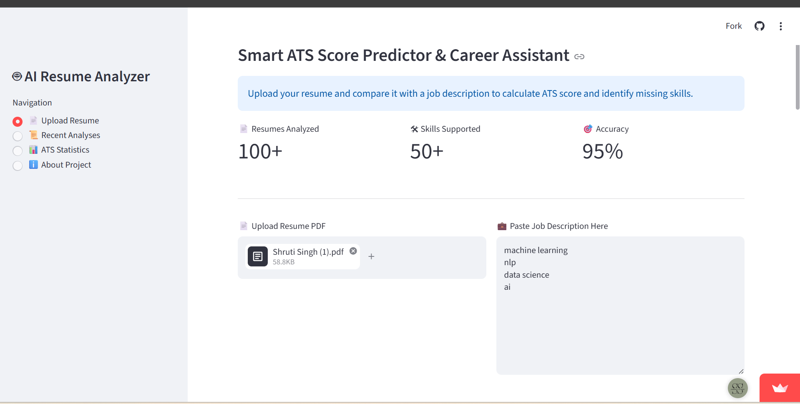
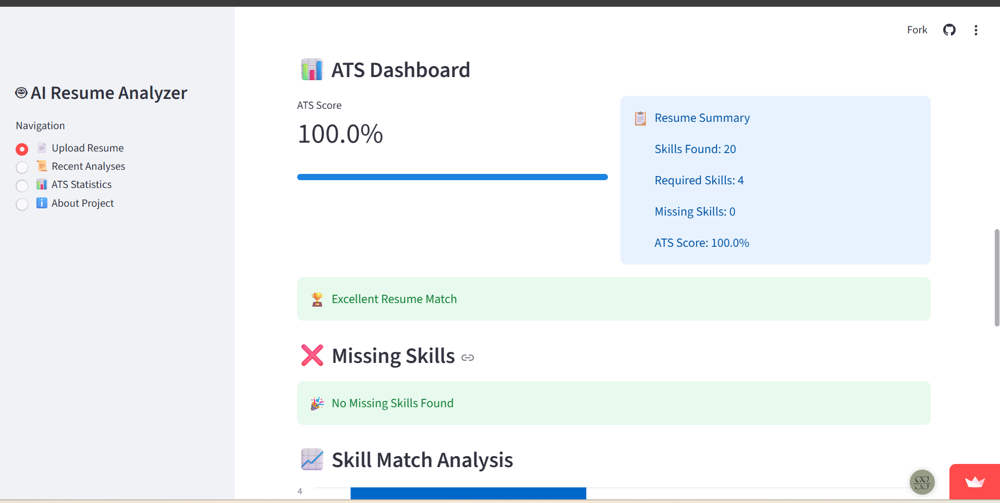

# AI Resume Analyzer

An AI-powered web application that analyzes resumes, extracts key skills, and provides insights to help improve job applications.

## Live Demo

https://airesumeanalyzer-urawcyzcnwczpa8ftrte7h.streamlit.app/

## Features

* Resume Upload (PDF)
* Skill Extraction
* Resume Analysis
* ATS-Friendly Insights
* Personalized Recommendations

## Tech Stack

* Python
* Streamlit
* NLP
* Pandas
* PDF Processing

## How It Works

1. Upload a resume in PDF format.
2. The application extracts and analyzes the content.
3. Skills and relevant information are identified.
4. Insights and recommendations are displayed to the user.

## Screenshots

### Home Page

### Resume Analysis

### Skills Extraction

## Future Improvements

* ATS Score Calculation
* Skill Gap Analysis
* Interview Question Generation
* Learning Roadmap Recommendations

## Author

Shruti Singh
